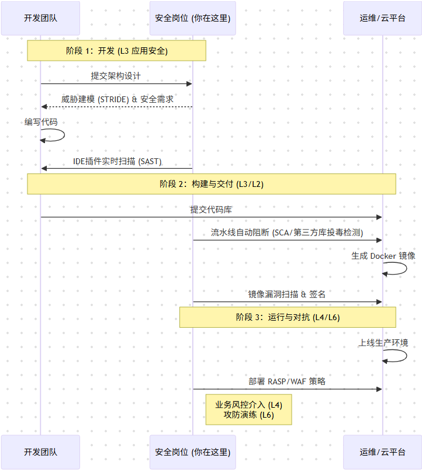

当我们谈论“网络安全”时，很多人脑海中浮现的只是杀毒软件或黑客代码。但对于像字节跳动这样拥有亿级用户、海量数据和复杂业务线的互联网巨头而言，安全绝非单点防御，而是一座精密设计、层层嵌套的**“数字城堡”**。

通过拆解字节跳动近期的数百个安全岗位需求，我们绘制出了这张**企业安全全景图**。让我们层层深入，看看这**八大核心防线**是如何构建起互联网世界的安全基石。

------

### 第一道防线：基础设施与系统安全

这是企业安全的底座，负责保障服务器、网络、办公环境的最底层安全。这层岗位的核心任务是守住服务器内核、办公网络和每一台员工的电脑，防止黑客通过底层漏洞“打地洞”进来。

- **核心职责**：
  - **系统内核加固**：深入 Linux/Windows 内核，防止底层提权和逃逸。
  - **办公网安全**：保护员工电脑、内部网络，防止钓鱼邮件和办公网入侵。
  - **物理与网络层**：防火墙、交换机安全配置。
- **对应岗位**：
  - **系统安全**：`系统安全研究员`、`Linux内核安全研发`、`Windows安全研发`
  - **终端防护**：`Mac终端安全工程师`、`Windows终端安全工程师`、`办公网安全工程师`
  - **基础运维**：`基础安全研发工程师`、`网络安全工程师`

------

### 第二道防线：云原生与虚拟化安全

随着企业业务全面上云，传统的边界防御失效，战场转移到了虚拟化容器和云平台上。这里的安全挑战在于“隔离”——确保成千上万个容器（Docker/K8s）之间互不干扰，防止黑客通过一个租户“逃逸”控制整个云。

- **核心职责**：
  - **容器逃逸检测**：防止黑客从 Docker/K8s 容器穿透到宿主机。
  - **云平台防护**：保障公有云/私有云的虚拟化隔离。
- **对应岗位**：
  - **云架构**：`云原生安全研究员`、`云安全工程师`、`云平台安全架构师`
  - **虚拟化**：`虚拟化安全研究员`、`BPaaS安全研发工程师`
  - **边缘计算**：`边缘云安全负责人`

------

### 第三道防线：应用与移动安全

这是用户感知最强的一层。抖音、TikTok、剪映等 App 在发布前，必须经过严格的“体检”。这层防线强调 **SDL（安全开发生命周期）**，即“安全左移”——在写代码的第一天就介入安全，并对最终的 App 进行加固，防止被反编译、篡改或植入恶意广告。

- **核心职责**：
  - **SDL (安全开发生命周期)**：在需求设计阶段就介入安全评估。
  - **代码审计与漏洞挖掘**：白盒/黑盒测试，挖掘 SQL 注入、XSS 等漏洞。
  - **客户端加固**：防止 App 被反编译、破解或植入恶意代码。
  - **软件供应链**：防止引用的第三方代码库（如 log4j）被投毒。
- **对应岗位**：
  - **移动端**：`Android安全研究员`、`iOS安全研究员`、`客户端漏洞挖掘工程师`
  - **Web与服务**：`Web渗透测试工程师`、`安全工程师-SDLC`
  - **供应链**：`软件供应链安全工程师`

------

### 第四道防线：业务安全与风控

黑客有时候不攻破服务器，而是利用规则漏洞来“薅羊毛”。这层岗位是直接帮公司“省钱”和“维护公平”的。他们对抗的是庞大的黑灰产团伙——从刷量的机器粉、游戏里的外挂，到发布违规内容的账号。

- **核心职责**：
  - **反作弊/反爬虫**：识别机器流量、群控设备，保护数据资产。
  - **游戏安全**：打击外挂、打金工作室，维护游戏公平。
  - **内容风控**：防止违规内容（涉黄、暴恐）在平台传播。
- **对应岗位（来自招聘数据）**：
  - **通用风控**：`业务安全工程师`、`风控策略分析师`、`账号安全策略运营`
  - **游戏专项**：`游戏安全工程师`、`游戏外挂分析工程师`、`游戏安全逆向`
  - **内容风控**：`内容安全研发`、`内容合规策略`

------

### 第五道防线：数据安全与隐私合规

在数据即资产的时代，这层防线是法律的红线（GDPR、个人信息保护法）。它的目标是确保用户的数据在全生命周期内都是隐秘且安全的。

- **核心职责**：
  - **隐私合规**：确保产品设计符合各国法律要求。
  - **数据防泄露 (DLP)**：防止敏感数据（源代码、用户 PII）流出公司。
  - **加密技术**：全态加密、多方安全计算。
- **对应岗位**：
  - **隐私合规**：`隐私保护安全专家`、`合规工程师`、`数据合规专家`
  - **数据技术**：`数据安全研发工程师`、`数据安全治理专家`
  - **密码学**：`密码学研究员`、`隐私计算研究员`

------

### 第六道防线：攻防对抗与威胁情报

最好的防御是进攻。企业内部会养两支军队：红队（Red Team）模拟黑客进行攻击，蓝队（Blue Team）负责检测和响应。同时，情报团队会时刻盯着全球黑客组织的动向，做到“敌未动，我先知”。

- **核心职责**：
  - **红蓝对抗**：模拟黑客攻击（红队）和防御检测（蓝队），检验防线有效性。
  - **安全运营 (SOC)**：7x24小时监控报警，处置突发事件。
  - **威胁情报**：溯源黑客组织（APT），提取攻击特征（IOCs）。
- **对应岗位**：
  - **攻击队（红队）**：`高级渗透测试工程师`、`红蓝对抗专家`、`漏洞挖掘工程师`
  - **防御检测（蓝队）**：`蓝军安全专家（武器化方向）`、`蓝军安全专家（实战攻防方向）`
  - **防守与运营**：`安全运营工程师`、`应急响应工程师`
  - **情报**：`威胁情报分析师`、`安全研究员-二进制方向`

------

### 第七道防线：AI 安全与前沿研究

这是伴随大模型爆发而诞生的新领域。当 AI 开始写代码、生成视频，安全问题也随之升级。这层岗位的人才在研究如何防止 AI 被“诱导”输出坏内容，或者如何保护 AI 模型本身不被窃取。

- **核心职责**：
  - **AI 安全**：研究大模型的对抗样本、模型窃取防御。
- **对应岗位：
  - **AI 安全**：`AI安全研究员`、`大模型安全算法工程师`、`AI系统安全`

### 第八层：安全管理与战略 (GRC)

这是连接技术与商业目标的桥梁。技术做得再好，如果管理混乱、不合规，企业依然面临巨大风险。

- **核心职能**：
  - **安全治理**：制定公司整体安全策略、流程和红线。
  - **身份与访问管理 (IAM)**：管理数字身份，不仅是技术开发，更是定义'谁'（Who）可以访问'什么'（What）的规则制定者，推行'零信任'架构。
  - **审计与合规**：应对监管检查，获取 ISO27001 等认证。
- **对应岗位**：
  - **审计与合规**：`安全合规专家`、`流程管理专家`
  - **身份与访问管理 (IAM)**：`IAM研发工程师`